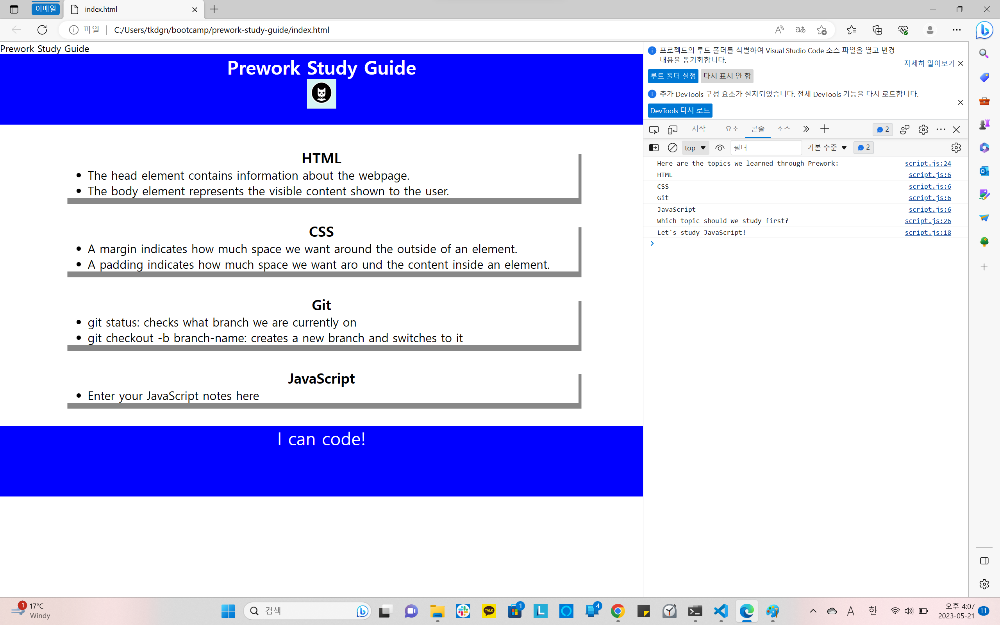

# <Prework Study Guide Webpage>

## Description

A prework-study guide was formed to give students a template to study on and add as they learn. Throughout this activity basics on how to crate a website was learnt.

## Installation

N/A

## Usage

Play around using dev tool by pressing control+shift+I

## Credits

N/A

## License

Open soource

